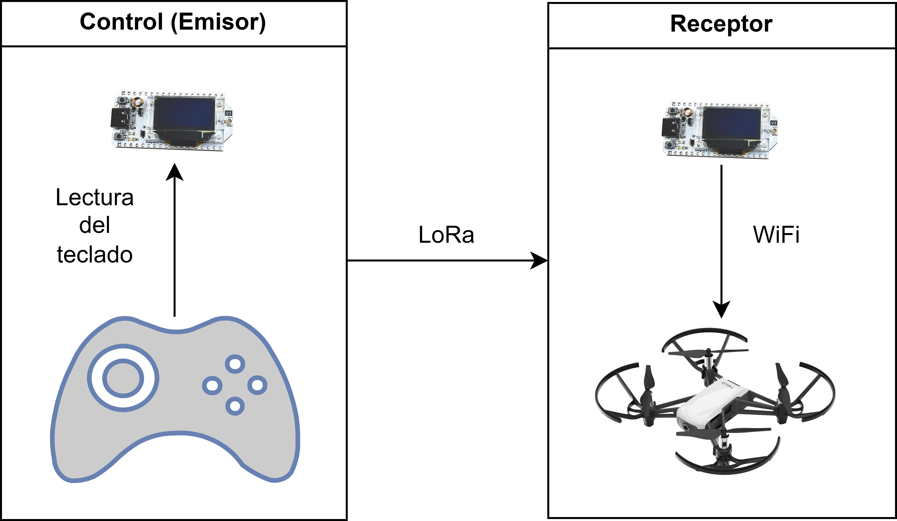
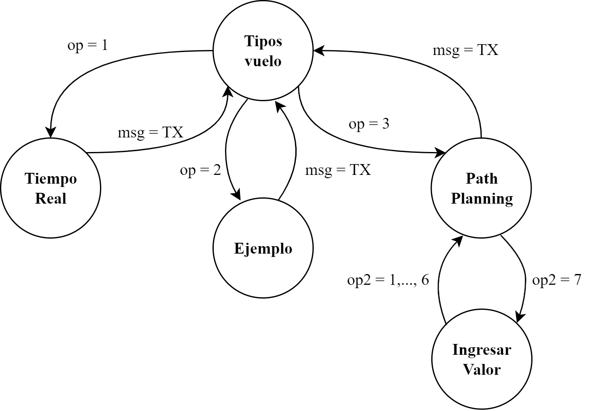

## Proyecto : Integración de Comunicación LoRa para el Control Autónomo del Drone DJI Tello usando Heltec V3

Este repositorio contiene la información sobre cómo controlar movimientos básicos de un Dron Tello usando módulos Heltec V3. El esquema implementado es el siguiente: 

  

Este proyecto consiste en controlar un dron DJI Tello usando LoRa, con el objetivo de enviar instrucciones desde un control hacia el dron a larga distancia. El esquema del funcionamiento del sistema se presenta en la Figura anterior. Para la ejecución de cada instrucción en el dron es necesario primero que el emisor reciba mediante un teclado qué comandos se desea enviar. El envío de estos comandos hacia el receptor que tiene conexión con el dron se realiza mediante mensajes LoRa en forma de cadena de texto, para lo cual se ha realizado un diccionario, que es usado por el receptor para definir qué instrucción será enviada al dron según el mensaje que ha recibido.

Para la implementación de LoRa se usa la librería SX126x-Arduino disponible en [este repositorio de GitHub](https://github.com/ElectronicCats/LoRaWAN-SX126x). El repositorio detalla las configuraciones de LoRa necesarias para los parámetros como frecuencia de operación, potencia de transmisión, factor de ensanchamiento, etc. Para la conexión del módulo receptor con el Dron Tello se usa la librería telloArduino disponible en [este repositorio en GitHub](https://github.com/akshayvernekar/telloArduino).

### Sistema de control

El sistema de control del Dron DJI Tello ofrece dos opciones de vuelo, la primera corresponde a una ejecución de un plan de vuelo preprogramado almacenado en la memoria del microcontrolador, mientras que la segunda funciona al establecer un vuelo autónomo mediante interacción con el Heltec LoRa, permitiendo la creación de una ruta dinámica.

  

**Figura**: Diagrama de flujo para el control de los escenarios de vuelo.

La figura anterior muestra las dos opciones de vuelo programadas para el control del dron y presenta una tercera opción correspondiente al control en tiempo real. Esta opción se incluye porque el sistema de control está diseñado con la proyección de incluir este modo de operación. Sin embargo, al momento de entregar este informe de proyecto, la programación de esta función no está finalizada. Por ello, no se incluye como una opción dentro de los planes de vuelo del dron, sino como una proyección para futuros desarrollos del proyecto.

- Jhonatan Cambisaca
- Henry Castro
- Henry Maldonado

## Sistema de recepción 

## Diseño de elemento de sujeción 